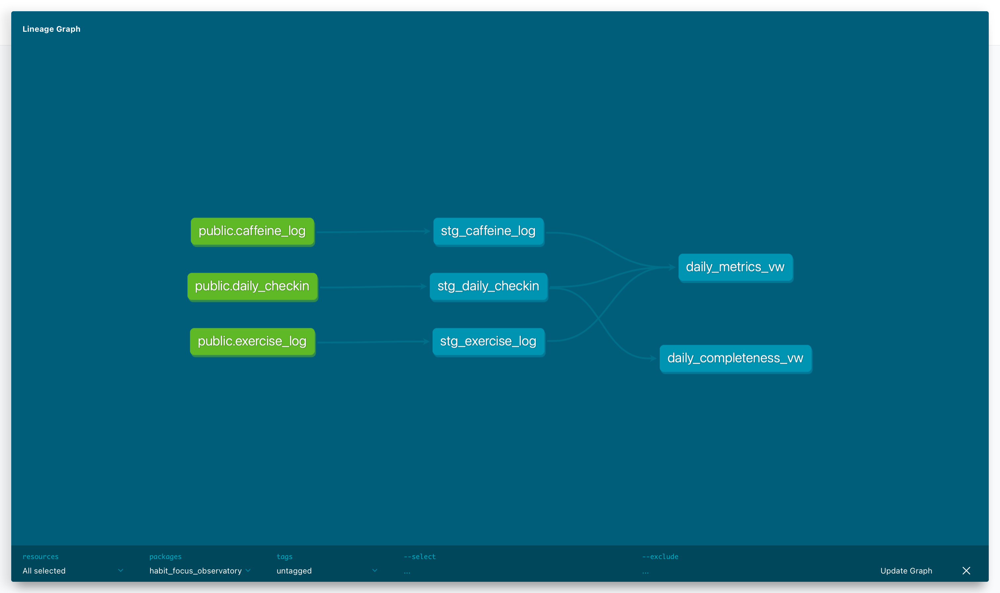

# habit-focus-observatory

## Project overview

Habit Focus Observatory is a working local MVP for personal analytics around
habit, energy, and focus tracking. It combines a Streamlit logging workflow,
PostgreSQL tables, SQL analytics views, and lightweight review charts for sleep,
deep work, caffeine, exercise, and daily self-ratings.

This is an MVP portfolio project, not a production health, wellness, or medical
application. It is designed to demonstrate data modeling and analytical workflow
thinking, not to provide health advice.

## What this project demonstrates

- Relational data modeling in Postgres
- SQL constraints, foreign keys, and analytics views
- Missing-data modeling: unknown/not logged vs explicitly logged zero
- Python database access and sample ingestion
- Streamlit form workflow
- Review charts and simple lagged relationship analysis

## Tech stack

- Python
- Streamlit
- PostgreSQL
- Docker
- SQL
- dbt
- pandas
- Altair
- psycopg

## App workflow

The Streamlit app is a single-page MVP with four form sections:

1. Today morning check-in
   - Saves or updates the selected date’s morning check-in with sleep hours, sleep quality, energy, focus, mood, stress, and notes. The form defaults to today.
2. Yesterday deep work
   - Saves or updates the selected date’s deep work summary using a single daily total of deep work minutes. The form defaults to yesterday.
3. Yesterday caffeine summary
   - Saves or updates the selected date’s caffeine summary using a single daily total and last caffeine time. The form defaults to yesterday.
4. Yesterday exercise
   - Saves or updates the selected date’s exercise summary with duration, intensity, and start time. The form defaults to yesterday.

Each section saves independently, so one part of the workflow can be updated
without resubmitting the others.

## Architecture

```text
Streamlit forms
    -> src/habit_repository.py
    -> PostgreSQL tables
    -> SQL views
    -> Streamlit review charts
```

The app code is intentionally small and direct:

- `app/streamlit_app.py` is the Streamlit entrypoint.
- `app/forms.py` renders the four logging forms.
- `app/review.py` renders the Recent Trends & Review section.
- `app/charts.py` contains Altair chart builders.
- `src/habit_repository.py` contains database read/write helpers.
- `src/ingest.py` loads sample CSV data.

## Data model

- `daily_checkin`
  - One row per date for sleep, self-ratings, notes, deep work, and logged-state flags.
- `caffeine_log`
  - Caffeine intake rows linked to `daily_checkin` by `checkin_date`.
- `exercise_log`
  - Exercise session rows linked to `daily_checkin` by `checkin_date`.

The current app writes caffeine and exercise as daily summaries, while the schema
keeps those concepts in separate child tables so the model can grow later.

## Analytics layer

- `daily_metrics_vw`
  - Produces one daily analytics row with rolled-up caffeine and exercise metrics,
    deep work minutes, morning ratings, prior-day sleep, and a rolling focus average.
- `daily_completeness_vw`
  - Tracks whether each daily workflow section has been logged.

The app also shows plain-English insight summaries generated from the currently
selected review window. These summaries compare logged patterns cautiously and
are intended as exploratory portfolio analytics, not advice.

The logged flags matter because `0` is a meaningful value. For example, a day can
have explicitly logged `0` minutes of deep work or `0` mg of caffeine. That is
different from a day where the form was never submitted and the value is still
unknown.

### dbt analytics models

The original `sql/views.sql` workflow still exists as a fallback for now. After
copying `profiles.yml.example` to `profiles.yml`, dbt can also build the
analytics views:

```bash
DBT_PROFILES_DIR=. dbt run
DBT_PROFILES_DIR=. dbt test
```

The dbt models recreate `daily_metrics_vw` and `daily_completeness_vw`, keeping
the same view names used by the Streamlit app.

The dbt lineage graph shows the analytics flow from the raw Postgres source
tables, through staging models, into the final app-facing analytics views:



## Local setup

From a fresh clone:

```bash
python3 -m venv .venv
source .venv/bin/activate
pip install -r requirements.txt
cp .env.example .env
docker compose up -d
```

Apply the schema and analytics views:

```bash
docker exec -i habit_focus_postgres psql -U habit_user -d habit_focus_db < sql/schema.sql
docker exec -i habit_focus_postgres psql -U habit_user -d habit_focus_db < sql/views.sql
```

Optionally load sample data:

```bash
python -m src.ingest
```

## Demo data

The repository includes synthetic data for local development and portfolio
review. The deterministic demo loader populates a fixed 30-day window so the app
can be evaluated without using real personal logs.

```bash
python scripts/load_demo_data.py
```

The loader inserts records for 2026-01-01 through 2026-01-30. It is safe to
rerun because it deletes and replaces only rows in that fixed demo date range
from `caffeine_log`, `exercise_log`, and `daily_checkin`; rows outside the demo
window are left untouched.

After loading the demo data, open the app and use the Review window selector in
the Recent Trends & Review section. The selector can show either the last 14
calendar days or the fixed synthetic demo window. Choose
`Demo window: 2026-01-01 to 2026-01-30` to show the deterministic demo
dataset instead of the current calendar window.

Run the app:

```bash
streamlit run app/streamlit_app.py
```

## Future improvements

- Apple Health or wearable import
- Richer weekly summaries
- Additional dbt tests and documentation
- More robust testing
- Deployment option

## Status

This is a working local MVP.
